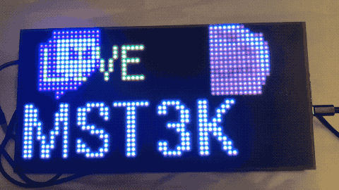

# The Garish Twitch RGBMatrix Display

Like to follow your favourite twitch streamers and want to really show it,
to the point of buying hardware dedicated to it?

"Features":
- Scrolling list of live twitch streamers you've selected
- "Now Live" exuberant display when someone goes live
- Scrolling twitch logo with "LIVE" in case it isn't obvious
- catJAM

This uses the Adafruit Matrix Portal M4 + 64x32 RGBMatrix which you can buy
as one convenient kit  https://www.adafruit.com/product/4812

Because twitch is twitch, you will have to get oAuth client id's to 
use the twitch API, as described in secrets.py.  